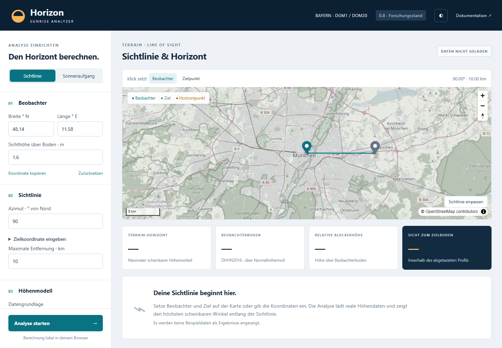

# Horizon Sunrise Analyzer

A static browser workbench for terrain horizons and solar-disk contact using official Bavarian DGM1 and DOM20 elevation data.

[Open the application](https://gtowncity.github.io/horizon-sunrise-analyzer/) · [Scientific model](docs/SCIENTIFIC_MODEL.md) · [User guide](docs/USER_GUIDE.md) · [Limitations](docs/LIMITATIONS.md)



## Features

- Map or coordinate-based sightlines, instrument height and finite-range terrain blocker.
- Official GeoTIFF download via the Bavarian ZIP service, IndexedDB cache and local file import.
- DGM1, optional DOM20 and surface-minus-terrain profiles.
- Directional curvature, independent terrestrial/astronomical refraction, azimuth horizon and spherical solar-disk contact.
- JSON/CSV/PNG export, worker progress/cancellation, mobile layout and textual profile values.

## Scientific status

**0.8.1 research release.** Models are implemented and tested; this is not a claim of physically exact first-visibility times. Angular/spatial sampling, partial DOM coverage, finite distance, geoid effects and atmosphere remain limitations. Numerical solver resolution is not observational accuracy. See [validation](docs/VALIDATION.md) and [uncertainties](docs/UNCERTAINTIES.md).

## Run and test

Requires Node 24 and npm.

```sh
npm ci
npm run dev
# validation
npm run lint
npm run typecheck
npm test
npm run build
npx playwright install chromium
npm run test:e2e
```

Push main to validate and deploy with the included [Pages workflow](.github/workflows/pages.yml). [Deployment instructions](docs/DEPLOYMENT.md). No frontend secrets or backend are required.

## Data and licensing

Datenquelle: [Bayerische Vermessungsverwaltung – www.geodaten.bayern.de](https://geodaten.bayern.de/opengeodata/) ([CC BY 4.0](https://creativecommons.org/licenses/by/4.0/)). Displayed angles/profiles are derived calculations. Basemap © OpenStreetMap contributors. Code: [MIT](LICENSE). [Source register](docs/SOURCES.json), [dependency licenses](docs/DEPENDENCY_LICENSES.md).

Private local reference coordinates, downloads and raw audit reports belong in the ignored `_local_audit/` and are not part of this public repository.
